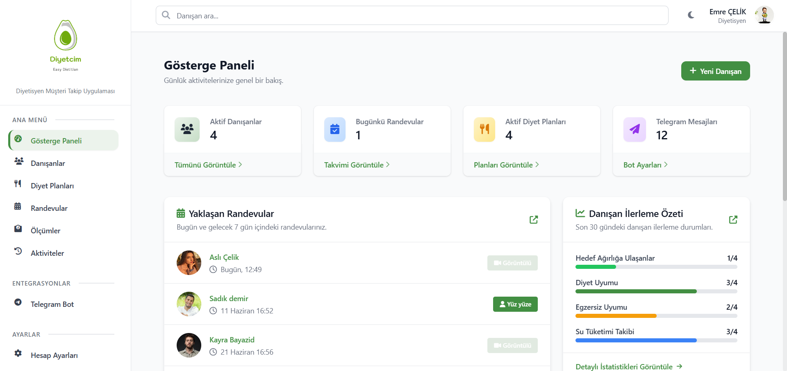
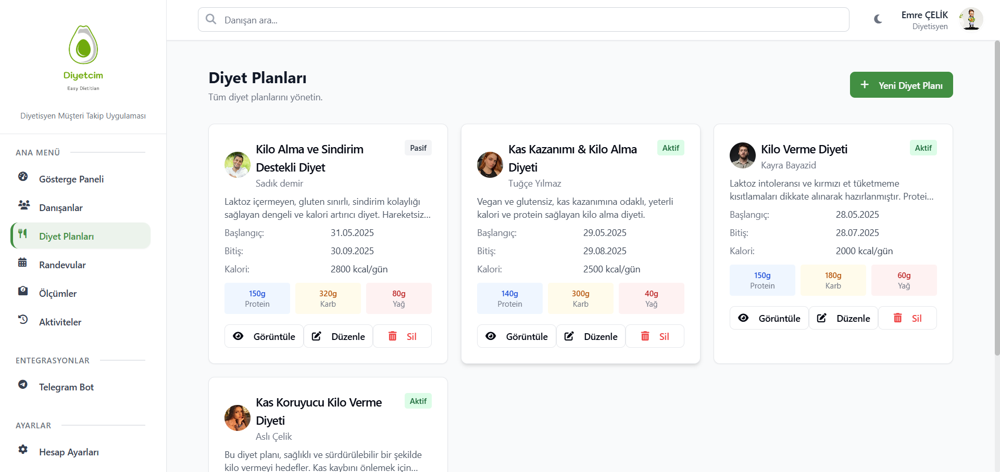

# 🥗 DiyetimTakip

**Diyetisyenler ve danışanlar için modern, akıllı ve çok platformlu takip uygulaması!**

---

## 🚀 Proje Hakkında

DiyetimTakip, diyetisyenlerin danışanlarını kolayca yönetebileceği, ölçümlerini ve diyet planlarını takip edebileceği, yapay zeka destekli ve Telegram entegrasyonlu bir platformdur. Hem **web** hem de **mobil** (iOS & Android) sürümleriyle her yerde yanınızda!

---

## 🌟 Özellikler

- **Yapay Zeka Destekli Diyet Planı**  
  Danışan bilgilerine göre otomatik, kişiselleştirilmiş diyet planı önerileri.

- **Gelişmiş Danışan Takibi**  
  Kilo, vücut ölçüleri, BMI, yağ oranı ve daha fazlası.

- **Randevu ve Takvim Yönetimi**  
  Akıllı randevu sistemi ve bildirimler.

- **Telegram Bot Entegrasyonu**  
  Danışanlara otomatik mesajlar, hatırlatmalar ve motivasyon bildirimleri.

- **Mobil ve Web Uyumlu**  
  Her cihazda, her platformda aynı deneyim.

- **Türkçe ve Kullanıcı Dostu Arayüz**  
  Tamamen Türkçe, modern ve sezgisel tasarım.

---

## 🖥️ Web Uygulaması

- **Teknolojiler:**  
  React, TypeScript, Tailwind CSS, Express.js, Node.js, MongoDB, JWT, Zod, React Query

- **Başlıca Sayfalar:**  
  - Giriş/Kayıt
  - Danışanlar
  - Diyet Planları (AI destekli)
  - Ölçüm Takibi (grafiklerle)
  - Randevular
  - Telegram Bot Yönetimi
  - Dashboard & İstatistikler

---

## 📱 Mobil Uygulama

- **Teknolojiler:**  
  React Native, Expo, React Navigation, AsyncStorage, React Native Paper, Chart Kit

- **Başlıca Ekranlar:**  
  - Dashboard (motivasyon sözleri, sağlık ipuçları)
  - Danışan Listesi & Detayları
  - Ölçüm Takibi & Grafikler
  - Diyet Planı Yönetimi
  - Randevu Takvimi
  - Profil & Ayarlar

---

## 🤖 Akıllı Özellikler

- **AI Diyet Planı:**  
  Yaş, cinsiyet, boy, kilo, aktivite seviyesi ve sağlık durumuna göre otomatik diyet planı.

- **Telegram Bot:**  
  Danışanlara toplu veya bireysel mesaj gönderme, referans kodu ile eşleştirme.

- **Gelişmiş Analiz:**  
  Kilo değişimi, hedef ilerleme, vücut ölçüleri ve daha fazlası.

---

## 🛠️ Kurulum

### Web için

```bash
cd diyetimweb
npm install
npm run dev
```

### Mobil için

```bash
cd diyetimapp
npm install
expo start
```

---

## 📸 Ekran Görüntüleri

<p align="center">
  
  
</p>
---

## 👨‍💻 Katkı Sağlamak

1. Fork'la ve kendi branch'inde çalış!
2. Pull request gönder.
3. Gelişime katkı sağla 🚀

---

## 📬 İletişim

Her türlü soru ve öneri için:  
**E-posta:** [mn.adymn23@gmail.com](mailto:mn.adymn23@gmail.com.com)

---

> **DiyetimTakip** ile danışanlarınıza daha akıllı, daha hızlı ve daha etkili destek verin!